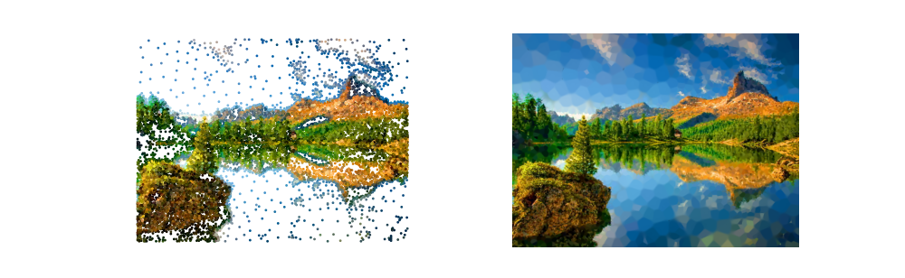

# Dynamic and Deep Nearest Neighbors in Pytorch
This algorithm does nearest neighbor approximation, building the
approximation in batch mode.  This could also be thought of as a radial basis function network built dynamically. Each batch adds the "centers" or "neighbors" that are not approximated correctly, so instead of using the entire dataset as the list of neighbors, only uses a subset. The entire thing runs on the GPU using pytorch.  During evaluation, instead of taking the k-nearest neighbor a weighted average of all neighbors
is used to compute the output (the weighting is a function of the inverse distance).

# Invariant MNIST
To run
```
python examples/mnist.py 
```
```
100%|█████████████████████████████████████████████████████████████████████████████████████████████████████▉| 937/938 [00:30<00:00, 30.30it/s]
Epoch_loop time 30.925434758999472
neighbors.device cuda:0
neighbor_class.device cuda:0
100%|██████████████████████████████████████████████████████████████████████████████████████████████████████| 938/938 [00:20<00:00, 45.58it/s]
Epoch_loop time 20.58123298099963
train_result Results(error=0.0067666666666666665, accuracy=0.9932333333333333, incorrect=406, total=60000)
100%|██████████████████████████████████████████████████████████████████████████████████████████████████████| 157/157 [00:03<00:00, 47.14it/s]
Epoch_loop time 3.330857837001531
test_result Results(error=0.0351, accuracy=0.9649, incorrect=351, total=10000)
neighbors in model 3255
```

# Image approximation using weighted neighbor approximation
The example below is approximately 1/10 data compression of the original image.
The left image shows the locations of the "centers", the right image shows the
approximation of the original using these centers. Training completes in a 3
seconds with large batch=256 on a NVidia 2080 and uses about 16,000 centers of the
196,608 centers available in the data set.
```
python examples/image_interpolation.py tolerance=0.2 target_accuracy=0.8
```

